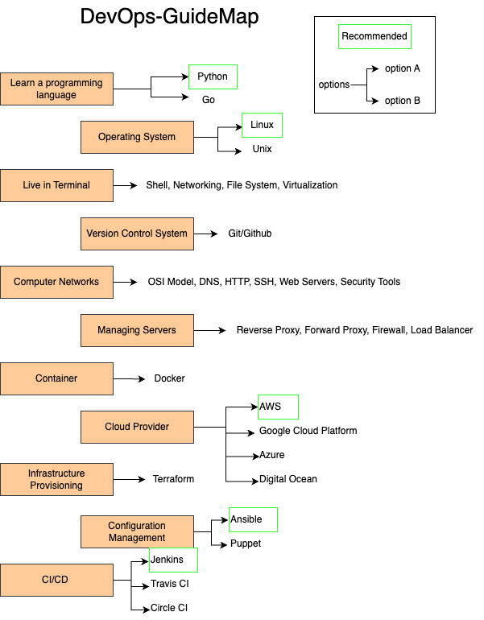

# DevOps GuideMap

Welcome to the DevOps GuideMap repository! Here, you'll find a collection of essential resources, guides, and materials related to DevOps and its associated topics. Whether you're a seasoned practitioner or a newcomer to the world of DevOps, this repository aims to provide you with valuable insights and knowledge to enhance your skills and understanding.

## Table of Contents

- [Introduction to DevOps](#introduction-to-devops)
- [GuideMap](#GuideMap)
- [Best Practices](#best-practices)
- [Tools and Technologies](#tools-and-technologies)
- [Case Studies](#case-studies)
- [Further Learning](#further-learning)
- [Contributing](#contributing)
- [License](#license)

## Introduction to DevOps

Gain a foundational understanding of DevOps, its principles, and its significance in modern software development.

## GuideMap

## Tools and Technologies

Look for essential tools and technologies used in DevOps practices. From version control to containerization and automation, find resources to master these technologies.

Version Control

- **Git**: Distributed version control for tracking changes and collaboration.
  - **Resources**: [Git Documentation](https://git-scm.com/doc), [Pro Git Book](https://git-scm.com/book/en/v2)

CI/CD

- **Jenkins**: Open-source automation server for building, testing, deploying.
  - **Resources**: [Jenkins Documentation](https://www.jenkins.io/doc/)
- **Travis CI**: Cloud-based CI service for testing, deployment.
  - **Resources**: [Travis CI Documentation](https://docs.travis-ci.com/)
- **CircleCI**: Cloud-based CI/CD platform for speed, simplicity.
  - **Resources**: [CircleCI Documentation](https://circleci.com/docs/)

Config Management

- **Ansible**: Automation tool for managing config, provisioning.
  - **Resources**: [Ansible Documentation](https://docs.ansible.com/)
- **Puppet**: Config management tool for automation, deployment.
  - **Resources**: [Puppet Documentation](https://puppet.com/docs/puppet/latest/puppet_index.html)
- **Chef**: Infra automation framework for managing servers, apps.
  - **Resources**: [Chef Documentation](https://docs.chef.io/)

Containerization

- **Docker**: Platform for developing, shipping, running apps in containers.
  - **Resources**: [Docker Documentation](https://docs.docker.com/)
- **Kubernetes**: Open-source container orchestration platform.
  - **Resources**: [Kubernetes Documentation](https://kubernetes.io/docs/)

Infrastructure as Code

- **Terraform**: IaC tool for provisioning, managing infrastructure.
  - **Resources**: [Terraform Documentation](https://www.terraform.io/docs/index.html)
- **CloudFormation**: AWS-specific IaC service for provisioning.
  - **Resources**: [CloudFormation Documentation](https://docs.aws.amazon.com/cloudformation/index.html)

Monitoring & Logging

- **Prometheus**: Open-source monitoring and alerting toolkit.
  - **Resources**: [Prometheus Documentation](https://prometheus.io/docs/introduction/overview/)
- **Grafana**: Platform for creating interactive, customizable dashboards.
  - **Resources**: [Grafana Documentation](https://grafana.com/docs/)
- **ELK Stack**: Tools for collecting, processing, visualizing logs, metrics.
  - **Resources**: [ELK Stack Documentation](https://www.elastic.co/guide/index.html)

## Contributing

Contribute to the DevOps community by sharing your knowledge. If you have valuable resources, guides, or insights to add, feel free to submit pull requests. Together, we can make this repository even more comprehensive and helpful.

---

Your contributions are valuable! If you have any ideas to improve this repository or want to report an issue, please [open an issue]([link-to-issue-tracker](https://github.com/janmeshjs/DevOps-GuideMap/issues)https://github.com/janmeshjs/DevOps-GuideMap/issues).

Happy learning and exploring the world of DevOps!
